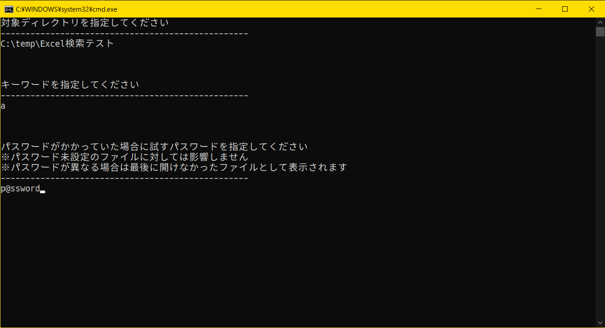
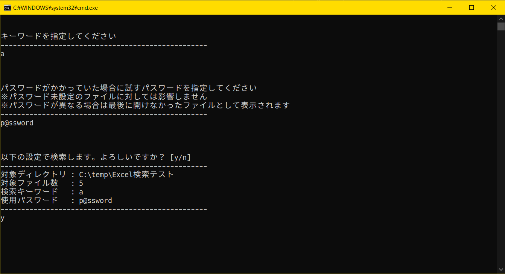
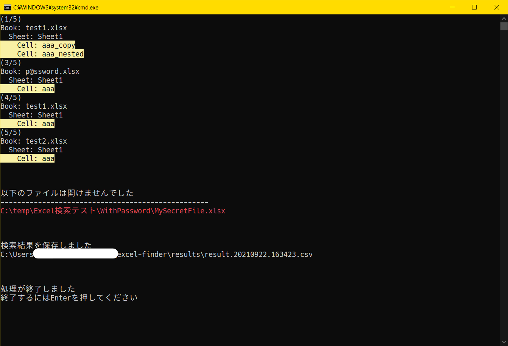

# Excel検索ツール

指定ディレクトリ配下の全てのExcelファイル（サブディレクトリ配下も含む）を対象に単語検索をかけて、ヒットしたセルの情報一覧をcsvに保存するツール

## 動作確認環境

> PowerShell 5.1
> Microsoft Office Excel 2016

- Excelがインストールされており、`New-Object -ComObject Excel.Application`でExcel.Applicationが呼び出せる必要がある
  - ComObjectにExcel.Applicationが含まれているかどうかは[このスクリプトモジュール](https://github.com/www-tacos/powershell-scripts/blob/main/common/Get-ComObjectList.psm1)を用いて`Get-ComObjectList | Select-String 'excel'`とすれば調べられる

- 試すことができないが、おそらくPowerShell 6.0以降でもExcelがインストールされておりComObjectが有効であれば当スクリプトを実行可能と思われる（ただし.NET Core版のPowerShellでComObjectが有効なのはWindows版だけの特殊仕様のためMac版のPowerShellでは当スクリプトは実行できない）

## 使い方

- main.lnkをクリックして起動する

- 検索対象のディレクトリを入力する

- 検索キーワードを入力する

- パスワードを入力する

- 検索の設定を確認して問題なければyを入力する

- コンソール上に検索の進捗が表示され、検索にヒットしたセルは色付きで表示される
- 開けなかったファイルは最後にまとめて表示される
- 検索結果はcsvとしてresultsディレクトリに保存される

## 参考記事

大部分の参考元
https://qiita.com/nejiko96/items/b423e2dda90181ef524e

パスワード指定について
https://qiita.com/gomeshun/items/9d1c5ac0fa2f7918bffa

列番号の変換
https://www.osadasoft.com/powershell-excel%E3%81%AE%E5%88%97%E5%90%8D%E3%82%92%E5%88%97%E7%95%AA%E5%8F%B7%E3%81%AB%E5%A4%89%E6%8F%9B%E3%81%99%E3%82%8B%E9%96%A2%E6%95%B0/

